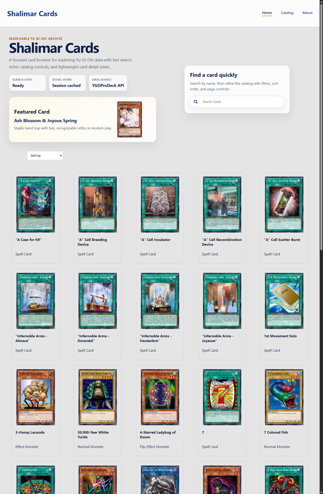
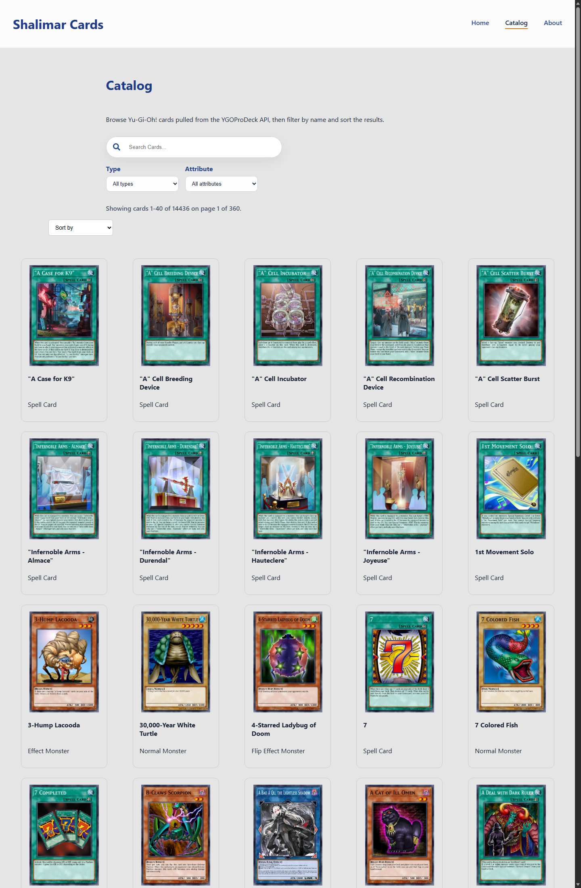
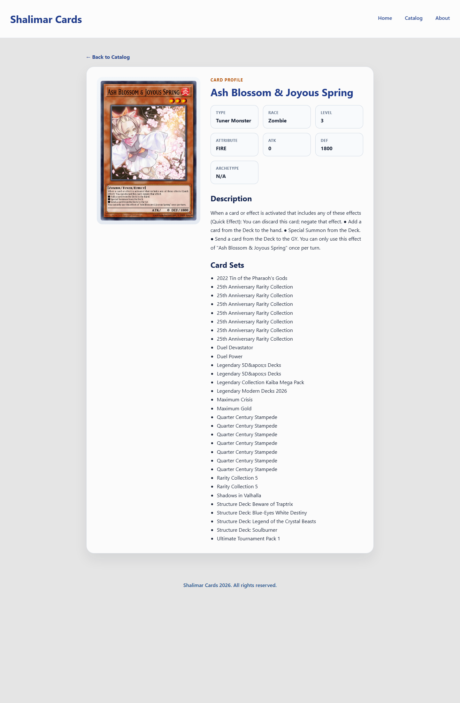

# Shalimar Cards

Shalimar Cards is a React-based Yu-Gi-Oh! card browser built around the YGOProDeck API. The project focuses on fast browsing, searchable catalog views, and lightweight card detail pages with enough structure to feel like a real product instead of a classroom prototype.

## Live Demo

[shalimar-cards.vercel.app](https://shalimar-cards.vercel.app/)

## Screenshots

### Home



### Catalog



### Card Details



## At A Glance

- Built as a class project, then refined into a portfolio-ready front-end build
- Focused on browse-state UX: search, filters, sorting, pagination, and preserved route context
- Designed to show practical React work instead of only static UI composition

## What It Does

- Browse live Yu-Gi-Oh! card data from the YGOProDeck API
- Search cards by name from both Home and Catalog views
- Filter the catalog by type and attribute
- Sort card results alphabetically or by ATK
- Navigate paginated catalog results with URL-persisted state
- Open card detail pages that preserve the originating browse context

## Current Highlights

- URL-backed browse state for search, filters, sort, and page selection
- Cached catalog pages and cached card detail responses for faster revisits
- Loading skeletons and styled error states for catalog and detail flows
- Route-aware tests covering catalog, detail, grid, and home behavior

## Core User Flow

1. Start on Home and search for a card by name.
2. Move into the Catalog for filtering, sorting, and paginated browsing.
3. Open a card detail page without losing the route context that led there.
4. Return to the exact filtered view instead of restarting the browse session.

## Portfolio Notes

This project began as a rough class assignment and was tightened into a more portfolio-ready build by improving the user flow instead of stopping at layout work. The strongest changes were in state persistence, catalog controls, caching, testing, and making the app easier to navigate and explain.

What I wanted this version to demonstrate:

- clear React route and state handling
- practical API integration with better UX around loading and failure states
- incremental product thinking beyond a default scaffold
- the ability to refine an early prototype into something presentation-ready

## What I Improved From The Prototype

- Replaced stock scaffold content with project-specific UI and documentation
- Persisted search, filter, sort, and page state in the URL
- Added cached catalog pagination and cached card-detail loading
- Improved loading, empty, and error states across the main routes
- Added focused tests around the actual user flow instead of only smoke coverage

## Stack

- React
- React Router
- Create React App
- Testing Library + Jest
- YGOProDeck API

## Run Locally

```bash
npm install
npm start
```

The app runs at `http://localhost:3000`.

## Useful Scripts

```bash
npm test -- --watchAll=false --runInBand
npm run build
```

## Project Direction

This project started as a class prototype and was tightened into a more portfolio-ready build by improving state handling, search persistence, pagination, caching, loading states, and UI polish. It is still intentionally lightweight, which leaves room for future additions like richer filters, collection tools, or deck-building features.
